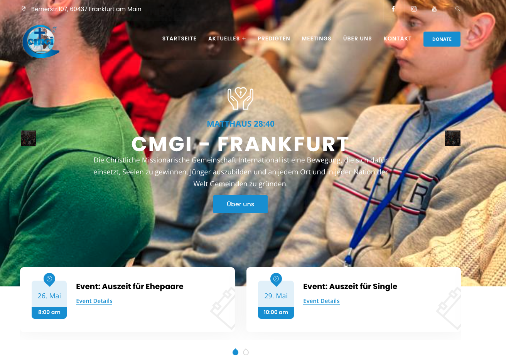

# CMGI - WEB - STORYBLOK

This is an example of a headless CMS `integration` project with the Nuxt Javascript Framework.

The app is deployed on : [Youth Challenge](https://www.cmgi-online.de/)
## Configuration Steps

1. Create new Space in Storyblok
2. Obtain the Preview Token from the Settings of the Space.
3. Replace the `accessToken` value in `nuxt.config.js` file with your Preview Token.
4. Your Nuxt project can be started and will consume data from your Storyblok Space.

## Build Setup

```bash
# install dependencies
$ npm install

# serve with hot reload at localhost:3000
$ npm run dev

# build for production
$ npm run build
```



This image shows the view from the CMS 🔥. Thanks to storyblok we can develop different components and integrate them into the CMS. This gives the possibility to a non-developer to manage the content of the pages without having to write code.

> For detailed explanation on how Nuxt 3 works, check out the [Nuxt 3 docs](https://v3.nuxtjs.org/guide/concepts/introduction).

> I found this Nuxt Course complete and very interessing. so ... click <a target="_blank" href="https://www.udemy.com/course/the-nuxt-3-bootcamp-the-complete-developer-guide/"> here 👌 </a>

> If you want to learn, how you can go headless with <a target="_blank" href="https://www.storyblok.com/tc/nuxtjs">Nuxt ... ✨</a>
